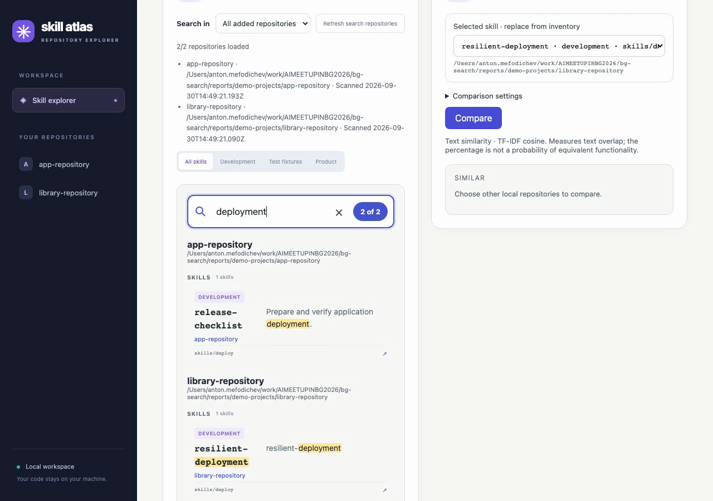

# Feature demos

[Multi-repository Filter video](multi-repository-filter.webm) — 21 seconds,
1280 × 900, WebM/VP8. Recorded from published application commit
`f3a50517cd95dc08fa1048726647dbef9ad8468a` for
[PR #4](https://github.com/Mefodys/bg/pull/4).

The recording uses the actual local server, native scanner/reader and two small
demo repositories. It shows a body-only query missing from Current repository,
finding it after selecting another added repository, opening that repository's
manifest, and searching both repositories in All added mode. The JSON catalogue
is filtered to these demo directories so optional host presets are not included.

Open/download the linked WebM in a browser or video player. The recording is
linked in the PR's Verification section and included in its Files changed.
