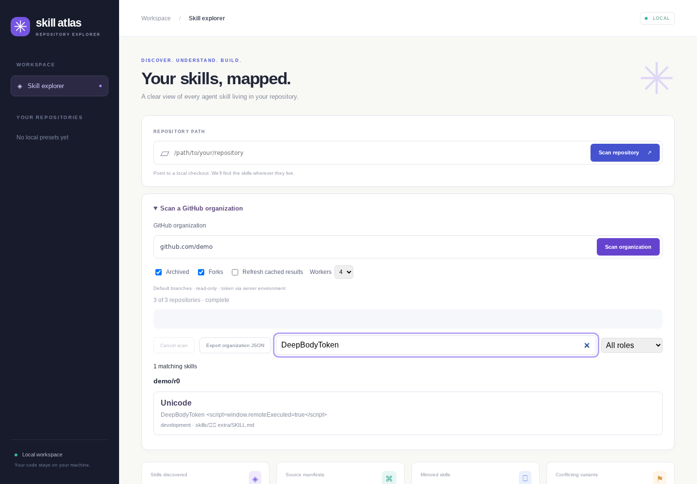
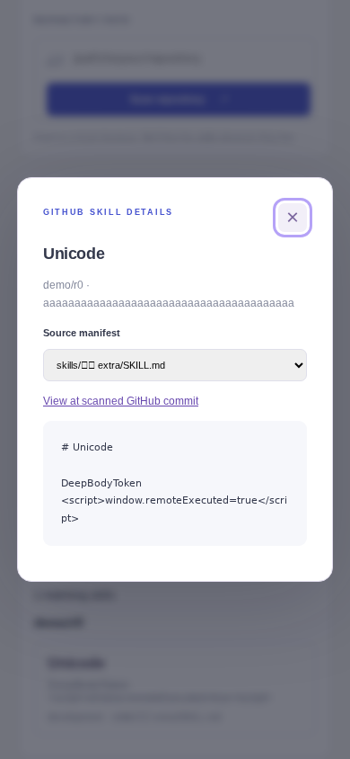

# GitHub organization demo

The GitHub API is replaced by a labelled seeded loopback fixture server in these
recordings. The rebuilt native selector/scanner runs for real; remote repository
code is never executed. The recordings exercise complete truncated-tree fallback,
progress, deep body search, literal untrusted content, pinned commit links,
manifest details, JSON export, categories, warm cache, partial failures and cancel.

Videos: [desktop](desktop.webm), [mobile](mobile.webm).

Environment: Ubuntu 24.04 x64, Node 24.13.0, Kotlin/Native 2.4.20,
Playwright 1.63.0, Chrome Headless Shell 153.0.8010.12,
desktop 1440×1000 / mobile 390×844, DPR 1, en-US, UTC, light/reduced motion.
Host libraries/fonts were isolated user-directory extractions. These local demos
are supplementary to pinned CI visual comparison; host fonts lack some CJK glyphs,
but Unicode/newline paths are exercised and asserted as data.

Scripts: tests/features/github.spec.mjs and tests/github-fixture.mjs. The PNGs and
recordings are reproduced by `npm run test:web` and uploaded in `feature-demos-SHA`.
The feature frames are independently repeated with exact pixels in pinned CI;
the unchanged common 23-scenario suite compares exact previous main and PR head.
