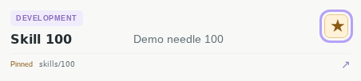
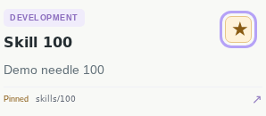

# Starred skills demo

Recorded against implementation commit 093b985, native scanner rebuilt from
source. Playwright 1.63.0, Chrome Headless Shell 153.0.8010.12, Ubuntu 24.04,
desktop 1440×1000 / mobile 390×844, DPR 1, en-US, UTC, light/reduced motion.
Local libraries/fonts were extracted into an isolated user directory; these
captures do not substitute for the pinned Linux CI comparison.

Videos: [desktop](desktop.webm), [mobile](mobile.webm).

The seeded demo creates 101 skills in each of two repositories and exercises
native scanning, keyboard pinning from page two, first-page ordering, details
synchronization, reload persistence, missing/restored manifests, query filtering
and multi-repository identities. Temporary paths/times are technical fields in
the videos. PNGs crop one selected card, so paths do not affect the frame.

Browser recordings are also produced by `npm run test:web` and uploaded as
`feature-demos-<SHA>` by CI. The pinned visual job generates an explicit initial
self-reference for added feature states, then verifies without updates. Existing
23 scenarios still compare against the exact previous main revision.
