# Skill tags visual run

Revision: 4bcac3937e6af91874b8939c5f94997384d8d79f. PR: https://github.com/Mefodys/bg/pull/9.

Isolated native server with versioned tag fixtures; initial self-reference is not a cross-revision acceptance.

Environment, suite/fixture/binary hashes, assertions and image hashes: [manifest.json](manifest.json).

## desktop/01-query

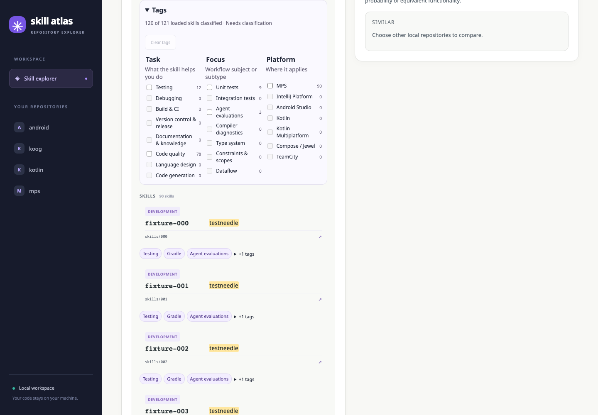

Count: 90 of 121; coverage: 120 of 121 loaded skills classified · Needs classification.

## desktop/02-task

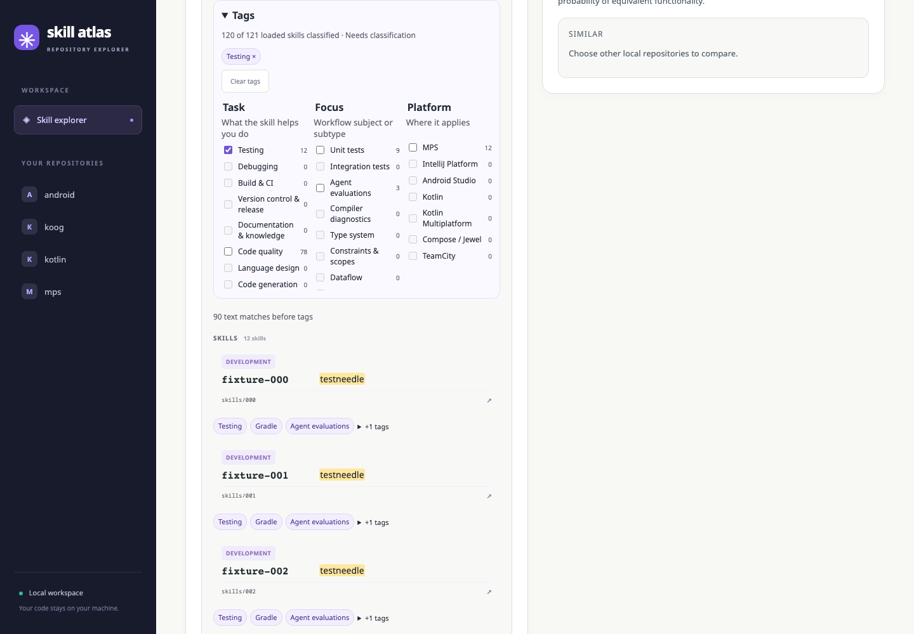

Count: 12 of 121; coverage: 120 of 121 loaded skills classified · Needs classification.

## desktop/03-task-focus

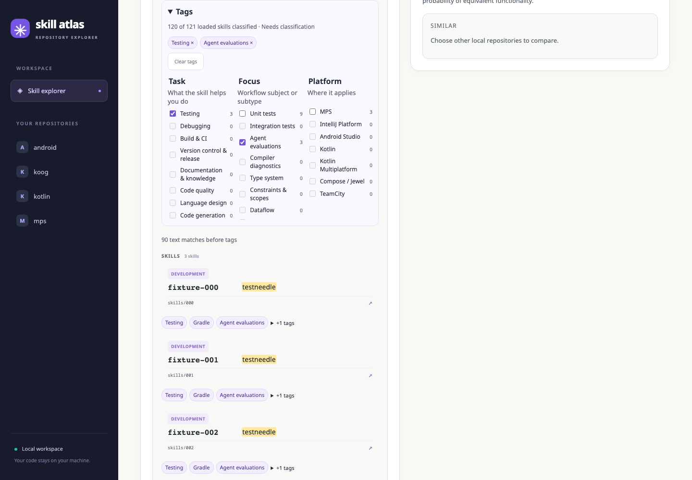

Count: 3 of 121; coverage: 120 of 121 loaded skills classified · Needs classification.

## desktop/04-unclassified

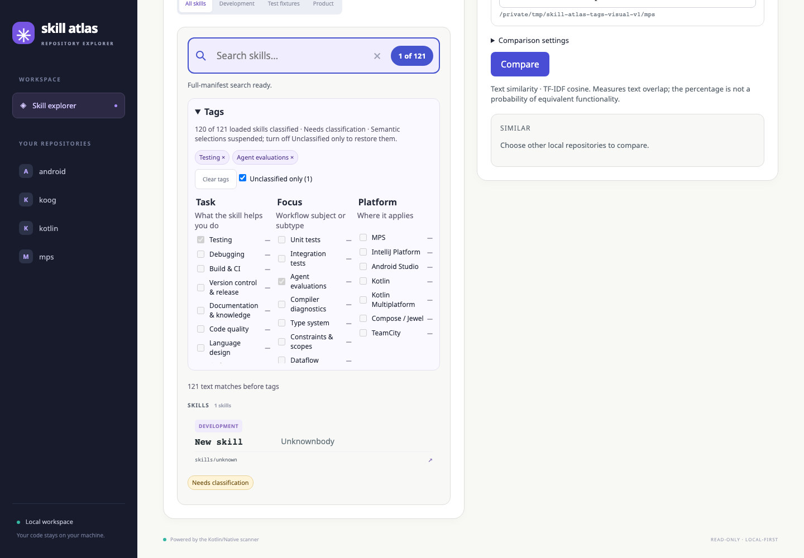

Count: 1 of 121; coverage: 120 of 121 loaded skills classified · Needs classification · Semantic selections suspended; turn off Unclassified only to restore them..

## desktop/05-changed

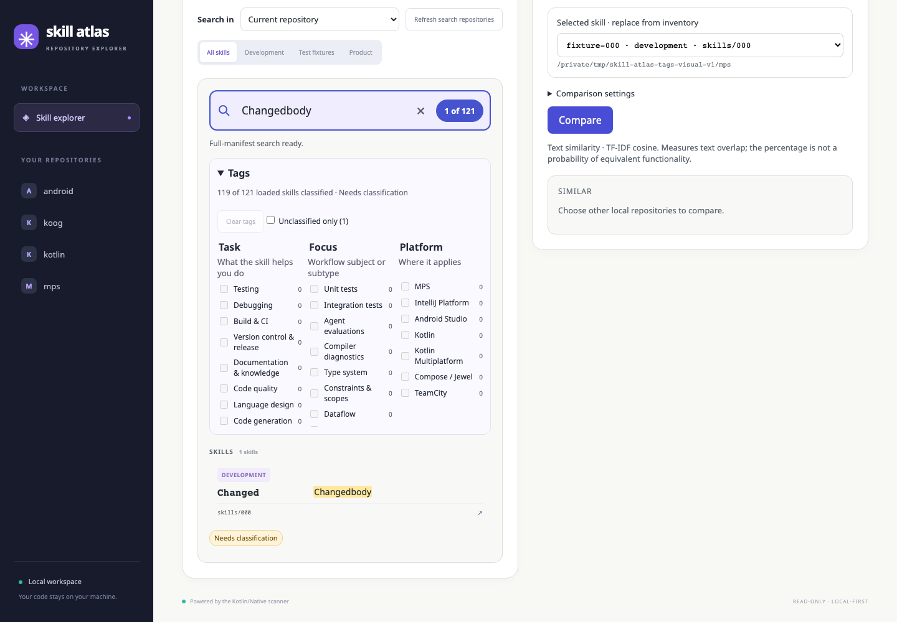

Count: 1 of 121; coverage: 119 of 121 loaded skills classified · Needs classification.

## desktop/06-owning-details

Count: 1 of 122; coverage: 121 of 122 loaded skills classified · Needs classification.

## desktop/07-zero-results

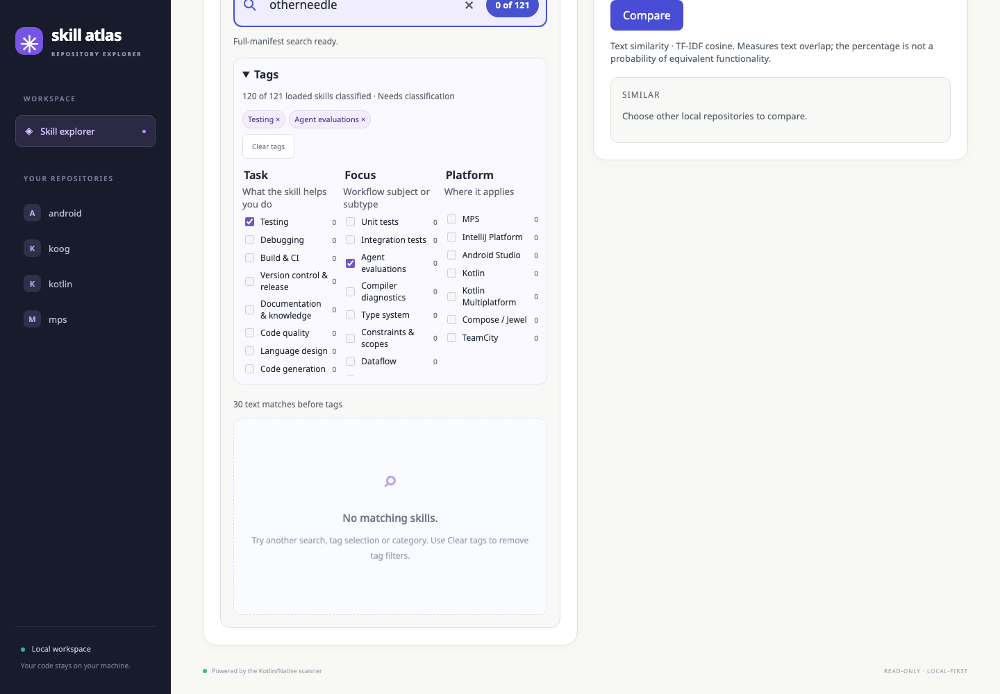

Count: 0 of 121; coverage: 120 of 121 loaded skills classified · Needs classification.

## desktop/08-clear-query

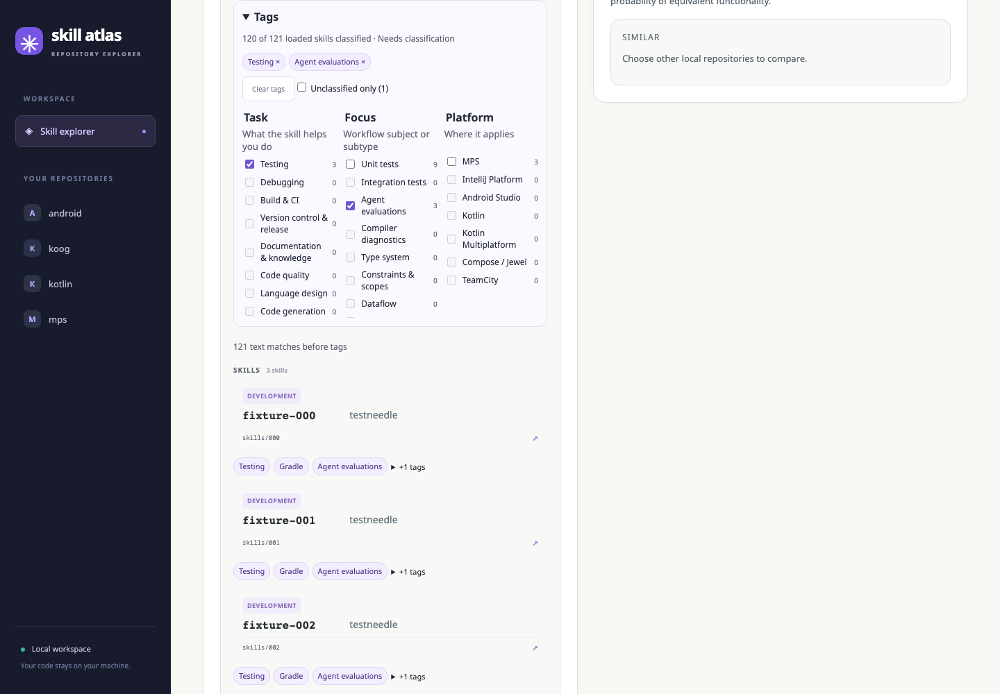

Count: 3 of 121; coverage: 120 of 121 loaded skills classified · Needs classification.

## desktop/09-similar

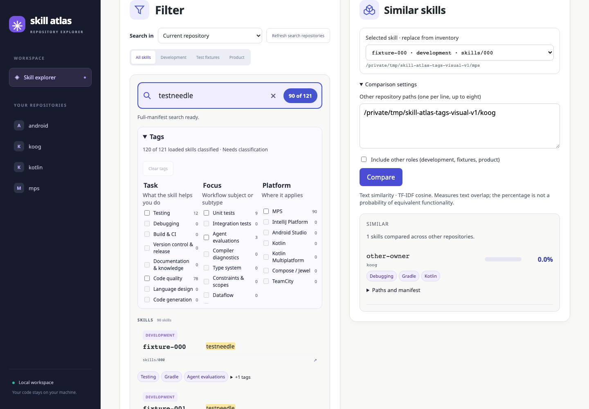

Count: 90 of 121; coverage: 120 of 121 loaded skills classified · Needs classification.

## desktop/10-unavailable

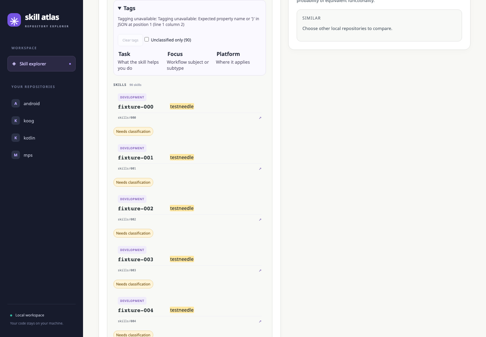

Count: 90 of 121; coverage: Tagging unavailable: Tagging unavailable: Expected property name or '}' in JSON at position 1 (line 1 column 2).

## mobile/01-facets

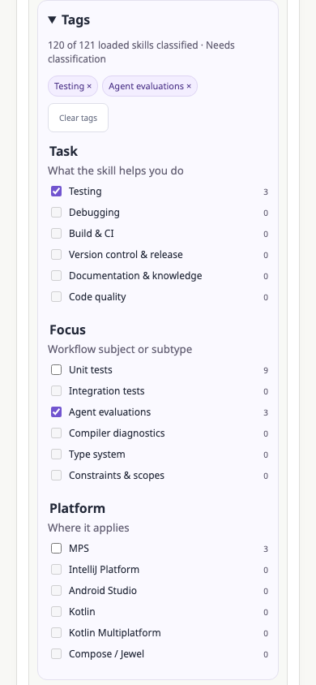

Count: 3 of 121; coverage: 120 of 121 loaded skills classified · Needs classification.

## mobile/02-details

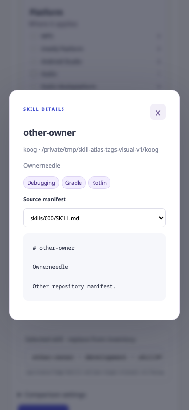

Count: 1 of 122; coverage: 121 of 122 loaded skills classified · Needs classification.
